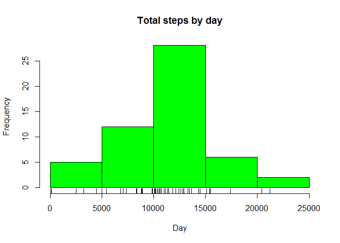
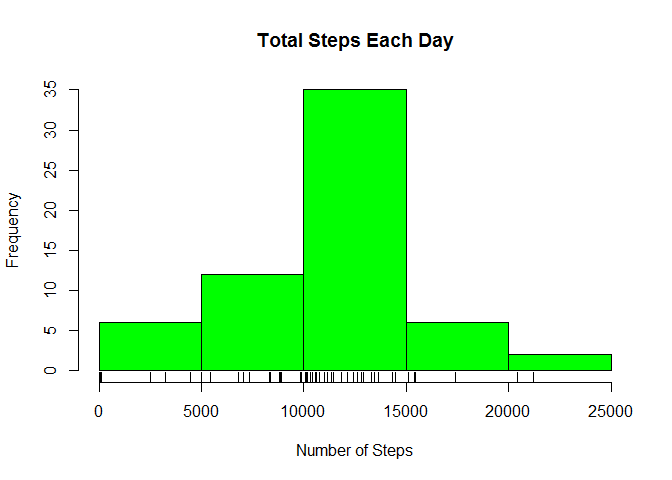
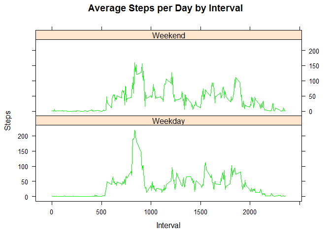

# Reproducible Research: Peer Assessment 1
Mohd Rizal  
September 19, 2015  
#Introduction
It is now possible to collect a large amount of data about personal movement using activity monitoring devices such as a Fitbit, Nike Fuelband, or Jawbone Up. These type of devices are part of the "quantified self" movement - a group of enthusiasts who take measurements about themselves regularly to improve their health, to find patterns in their behavior, or because they are tech geeks. But these data remain under-utilized both because the raw data are hard to obtain and there is a lack of statistical methods and software for processing and interpreting the data.

This assignment makes use of data from a personal activity monitoring device. This device collects data at 5 minute intervals through out the day. The data consists of two months of data from an anonymous individual collected during the months of October and November, 2012 and include the number of steps taken in 5 minute intervals each day.

## Loading and preprocessing the data

```r
#clear all workspace
rm(list=ls())
#set working directory
setwd("C:/Users/MohdRizal/Dropbox/DataScience/Reproducible Research")

#Library needed
require(downloader)
```

```
## Loading required package: downloader
```

```r
library(knitr)
library(data.table)
library(lattice)

#download files *.zip and extract it
if(!file.exists("./data")){dir.create("./data")}
fileUrl <- "https://d396qusza40orc.cloudfront.net/repdata%2Fdata%2Factivity.zip"
download(fileUrl,destfile="./activity.zip",mode = "wb")
unzip(zipfile="./activity.zip",exdir="./data")

#set to ./data folder
setwd("C:/Users/MohdRizal/Dropbox/DataScience/Reproducible Research/data")
data.activity <- read.csv("activity.csv")
names(data.activity)
```

```
## [1] "steps"    "date"     "interval"
```

```r
# Convert the date attribute to an actual date format
data.activity$date <- as.POSIXct(data.activity$date, format="%Y-%m-%d")
```

## What is mean total number of steps taken per day?

```r
#aggregate steps and calculate the total steps taken per day
steps.total <- aggregate(steps ~ date, data = data.activity, sum, na.rm = TRUE)
#plot histogram
hist(steps.total$steps, main = "Total steps by day", xlab = "Day", col = "green")
rug(steps.total$steps)
```

 

```r
#mean value
mean.steps <- mean(steps.total$steps)
mean.steps
```

```
## [1] 10766.19
```

```r
#median value
median.steps <- median(steps.total$steps)
median.steps
```

```
## [1] 10765
```
## What is the average daily activity pattern?

```r
#aggregate the steps interval (steps X interval)
steps.interval <- aggregate(steps ~ interval, data = data.activity, mean)
plot(steps.interval$interval,steps.interval$steps, type="l", xlab="Interval", 
     ylab="Number of Steps",main="Average Number of Steps per Day by Interval")
```

 

```r
#maximum 5-min interval
max.interval <- steps.interval[which.max(steps.interval$steps),1]
```
####The 5-minute interval that contains the maximum of steps, on average across all days, is

```r
max.interval
```

```
## [1] 835
```

## Imputing missing values

```r
#calculate and report the total of missing value
incomplete <- sum(!complete.cases(data.activity))
incomplete
```

```
## [1] 2304
```

```r
#calculate imputed.data
imputed.data <- transform(data.activity, steps = ifelse(is.na(data.activity$steps), 
        steps.interval$steps[match(data.activity$interval, steps.interval$interval)], 
        data.activity$steps))
imputed.data[as.character(imputed.data$date) == "2012-10-01", 1] <- 0
steps.by.day.i <- aggregate(steps ~ date, imputed.data, sum)
hist(steps.by.day.i$steps, main = paste("Total Steps Each Day"), col="green", 
     xlab="Number of Steps")
rug(steps.by.day.i$steps)
```

 

```r
#calculate imputed.data mean and median
mean.i <- mean(steps.by.day.i$steps)
median.i <- median(steps.by.day.i$steps)
mean.i
```

```
## [1] 10589.69
```

```r
median.i
```

```
## [1] 10766.19
```

```r
#calculate mean and median diff
mean.diff <- mean.i - mean.steps
med.diff <- median.i - median.steps
mean.diff
```

```
## [1] -176.4949
```

```r
med.diff
```

```
## [1] 1.188679
```

```r
#calculate total difference
total.diff <- sum(steps.by.day.i$steps) - sum(steps.total$steps)
total.diff
```

```
## [1] 75363.32
```

## Are there differences in activity patterns between weekdays and weekends?

```r
weekdays <- c("Monday", "Tuesday", "Wednesday", "Thursday", 
              "Friday")

imputed.data$dow = as.factor(ifelse(is.element(weekdays(as.Date(imputed.data$date)),
                weekdays), "Weekday", "Weekend"))

steps.by.interval <- aggregate(steps ~ interval + dow, imputed.data, mean)

#plot the graph
xyplot(steps.by.interval$steps ~ steps.by.interval$interval|steps.by.interval$dow, 
       main="Average Steps per Day by Interval",xlab="Interval", ylab="Steps",
       layout=c(1,2), type="l", col = "green")
```

 
